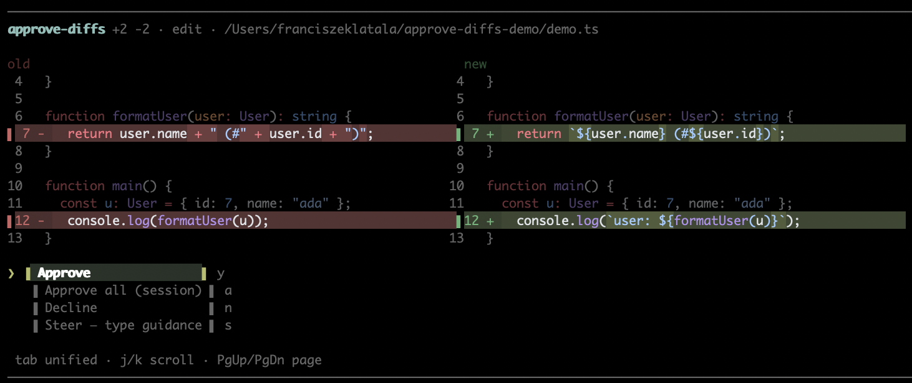
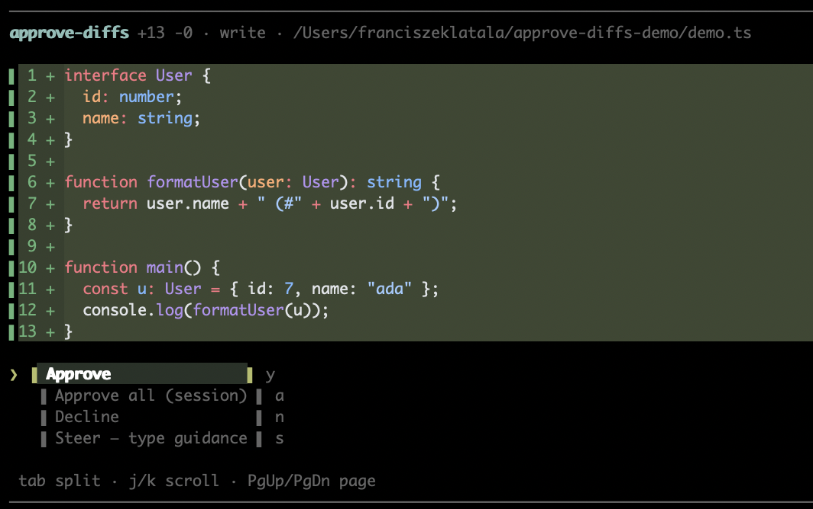
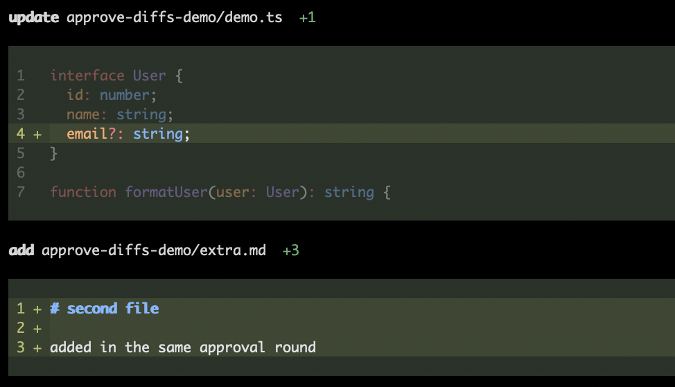

# pi-approve-diffs

**Approve, decline, or steer every file change before it happens — with syntax-highlighted diffs.**

A [pi](https://pi.dev) extension that gates pi's file-mutating tools (`write`, `edit`,
`hashline_edit`, `apply_patch`) behind a review step. Nothing touches disk until you say so.

```
──────────────────────────────────────────────────────────────────
 approve-diffs +1 -1 · edit · src/app.ts

   function greet(name: string) {
 -   console.log("hello " + name);
 +   console.log(`hello, ${name}!`);
     return name.length;
   }

 ❯ ▐ Approve                 ▌ y
   ▐ Approve all (session)   ▌ a
   ▐ Decline                 ▌ n
   ▐ Steer — type guidance   ▌ s

 tab unified · j/k scroll · PgUp/PgDn page
──────────────────────────────────────────────────────────────────
```

The diff renders with a dark background and green/red only on changed lines —
no giant colored slab. After you approve, the change lands and the result
renders as a green-highlighted box in the transcript (toggleable, see below).

## Examples







## Install

```bash
pi install pi-approve-diffs
```

Then restart pi (or `/reload`). Requires `pi` with extension support (≥ 0.84).

If the npm package is not available yet in your environment, install from GitHub or a local clone:

```bash
pi install git:https://github.com/flatala/pi-approve-diffs
pi install ~/pi-approve-diffs
```

## The approval modal

Appears docked at the bottom of the screen, right where you type. Every file
change stops here first.

| Key | Action |
|---|---|
| `↑` `↓` | move between actions |
| `Enter` | confirm the selected action |
| `y` / `a` / `n` / `s` | hotkeys: approve / approve-all-session / decline / steer |
| `Tab` | toggle split ↔ unified diff view |
| `j` `k` / `PgUp` `PgDn` `b` `Space` / `Home` `End` | scroll the diff |
| `Esc` | decline |

**Steer** declines the change *and* sends your typed guidance back to the
agent ("declined, follow this instead: …"), so you can redirect it without a
separate message.

Multi-file changes (`apply_patch`) show each file as its own section —
a dark header with `+N -M` stats, then the framed diff for that file.

## Commands

```
/approve-diff              status
/approve-diff on|off       enable / disable the gate (persisted)
/approve-diff toggle       flip it
/approve-diff yolo         stop asking for the rest of this session
/approve-diff results on|off   toggle post-approval green result boxes
```

## Post-approval result boxes

Approved changes render in the transcript as green-backgrounded diff boxes
(dark header line, framed diff body). If you prefer a quiet transcript:

```bash
/approve-diff results off
```

…then `/reload`. Declines and steers always show their reason either way.

## Configuration

`~/.pi/agent/extensions/pi-approve-diffs.json`:

```json
{
  "enabled": true,
  "results": true
}
```

- `enabled` — gate on/off (also `/approve-diff on|off`)
- `results` — post-approval highlight boxes (also `/approve-diff results on|off`)

Both are safe to delete; defaults restore on next start.

## Dev

```bash
git clone https://github.com/flatala/pi-approve-diffs
cd pi-approve-diffs
npm install
npm run typecheck   # tsc --noEmit
npm run check       # assert-based self-check of the vendored renderer
pi -e ./src/index.ts
```

## Publish

Version with npm (choose one):

```bash
npm run release:patch
npm run release:minor
npm run release:major
```

Then push the version commit + tag:

```bash
git push --follow-tags
```

Publishing is handled by `/home/runner/work/pi-approve-diffs/pi-approve-diffs/.github/workflows/npm-publish.yml` on `v*` tags (or manual dispatch), and runs:

```bash
npm run prepublishOnly
npm publish
```

Set repository secret `NPM_TOKEN` with publish access to the target npm package.
After publish, `pi install pi-approve-diffs` should resolve once pi's package index refreshes.

## How it works

`src/index.ts` hooks pi's `tool_call` event, builds the pre-apply diff in
`src/preview.ts`, and shows the modal from `src/ui.ts` via `ctx.ui.custom`.
Diff rendering is vendored from
[@heyhuynhgiabuu/pi-diff](https://github.com/buddingnewinsights/pi-diff)
(Shiki-powered, MIT — see `src/vendor/pi-diff/LICENSE`), patched for this
extension: pending calls stay neutral, results only highlight after approval.

## Inspired by

- [pi-show-diffs](https://github.com/xRyul/pi-show-diffs) — the pre-apply approval modal concept
- [pi-diffloop](https://github.com/lucaspiritogit/pi-diffloop) — approve / decline / steer actions
- [@heyhuynhgiabuu/pi-diff](https://github.com/buddingnewinsights/pi-diff) — the Shiki renderer, vendored here

## License

MIT — see [LICENSE](LICENSE). The vendored renderer keeps its upstream MIT
notice.
